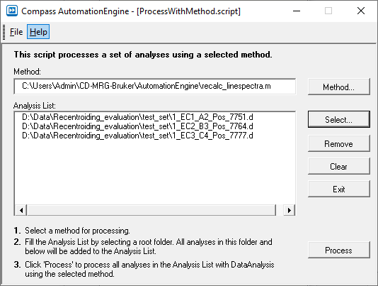
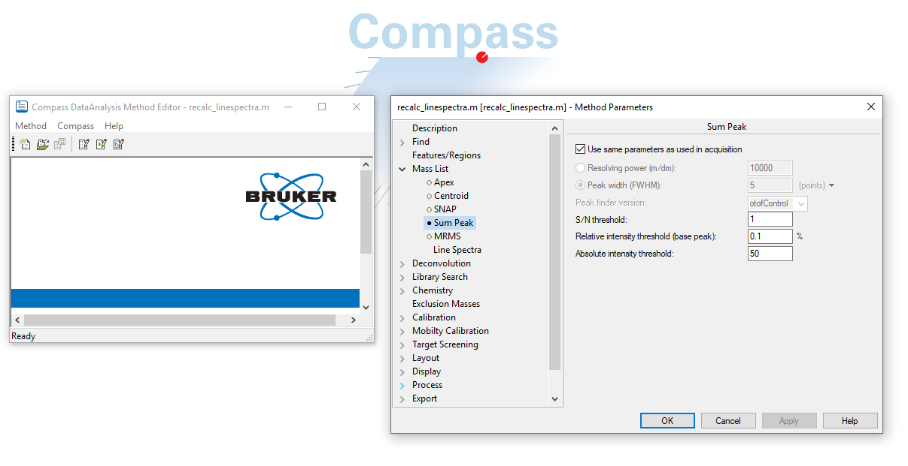

# CD-MRG-Bruker
Code and documentation pertaining to Bruker software for LC-MS data. 

## Source 
Metabolomics Research Group, department of Congenital Diseases at Statens Serum Institite (SSI) Denmark.

## Bruker Data Analysis 
Tasks in **Data Analysis (DA)** can be automated using the Visual Basic Script (VBS) api. 

To process loaded files in DA using scripts,

1) click *Method > Open Script Only ...*;
2) Click *Method > Run*

### Scripts
These scipts require files to be imported to the DA *Analysis List*. For >10 files, see []

- [Export Bruker files to mzML](https://github.com/ssi-dk/CD-MRG-Bruker/blob/main/DataAnalysis/exportMzML.dascript) 

- [Recalculate linespectra from profile spectra](https://github.com/ssi-dk/CD-MRG-Bruker/blob/main/DataAnalysis/recalc_linespectra.dascript) 

### Batch processing
DA is not designed to handle multiple files; loading more than 10-20 files typically causes the program to freeze. If you want to process multiple data files (e.g. a batch) using DA, the best option is to use the ***ProcessWithMethod*** program which you can start in DA by clicking *Tools > ProcessWithMethod*.  (ProcessWithMethod is a *Compass AutomationEngine script*. )

In *ProcessWithMethod* you load a ***method file*** that defines operations applied to all files in the Analysis list; click Select to add files to the Analysis list for processing. Click process to start the analysis; you cwill see the progress in the Compass DA *ProcessQueuer*. 

#### Editing the method file
Open the Bruker **Compass MethodEditor** app and load the method file by clicking *Method > Open*. 

Click *Method > Script* to view the commands/methods/algorithms that will be executed for each file when the method is run.
Click *Method > Parameters* to view and set the parameters associated with commands/methods. 

##### Example
to change the parameters for the Sum Peak algorithm used to compuute the line spectra (i.e. the spectral centroids of the profile spectra), open the file 'recalc_linespectra.m and then click Method -> Parameters and then click on the MassList->Sum Peak  section as shown below

